# 教室で使えるかもしれないもの作り #◯ 「それ反則だよ！」でけんかにならない。1台を二人で囲む対戦パズルアプリ「カベカベ合戦！」

## 🏫 はじめに

雨の日の休み時間、教室にボードゲームを出してみたものの、ルールの説明だけで10分が過ぎてしまった、ということはありませんか。ようやく始まったと思ったら、今度は「それ反則だよ」「いや、いいんだよ」の言い合いが始まって、結局こちらが審判に呼ばれる。育てたかったのは考える力なのに、いちばん使ったのはこちらの体力だった、ということになりがちです。

かといって一人一台の端末を配ると、今度は全員がちがう画面を見て、しんと静かになってしまう。二人で顔を合わせて、うんうん唸りながら考える時間が、なかなか作れないのではないでしょうか。

そこで作ったのが「カベカベ合戦！」です。1台の端末を二人で囲んで、かわりばんこに指す対戦パズルです。コマを進めて向こう岸を目指す。相手の前にカベを置いて、じゃまをする。それだけのゲームですが、反則になる手はアプリのほうが止めてくれるので、ルールを知らない子どうしでも言い合いになりません。

こちらから遊べます。

https://quoridor.giga-school.com/

もとになっているのは「コリドール」という有名なボードゲームです。ただ、そのまま作ってはいません。低学年でも迷わないように、ルールを一つ減らしてあります。そのあたりの、あえてそうしなかったことも含めて書いていきます。

## 📱 このアプリでできること

開くと、まずこの画面が出ます。

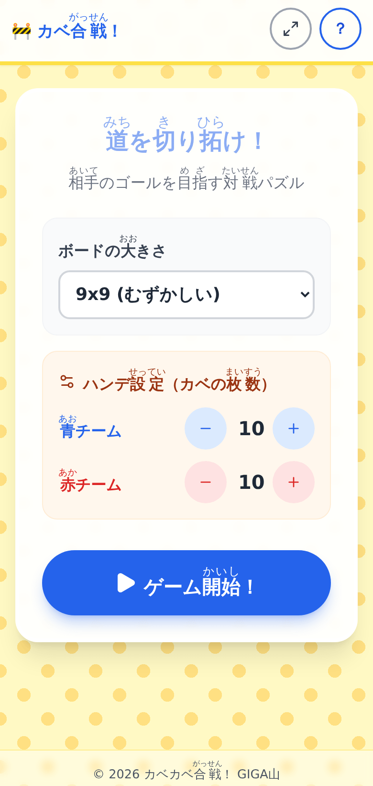

盤の大きさと、カベの枚数を決めるところ。ここから「ゲーム開始！」を押します。

盤の大きさは三つから選べます。5x5がかんたん、7x7がふつう、9x9がむずかしいです。はじめは9x9になっていて、これが本式のコリドールと同じ大きさです。低学年の子や、はじめて触る子には5x5をおすすめします。

盤を選び直すと、カベの枚数もその盤に合った数に戻ります。9x9なら10枚、7x7なら6枚、5x5なら3枚です。

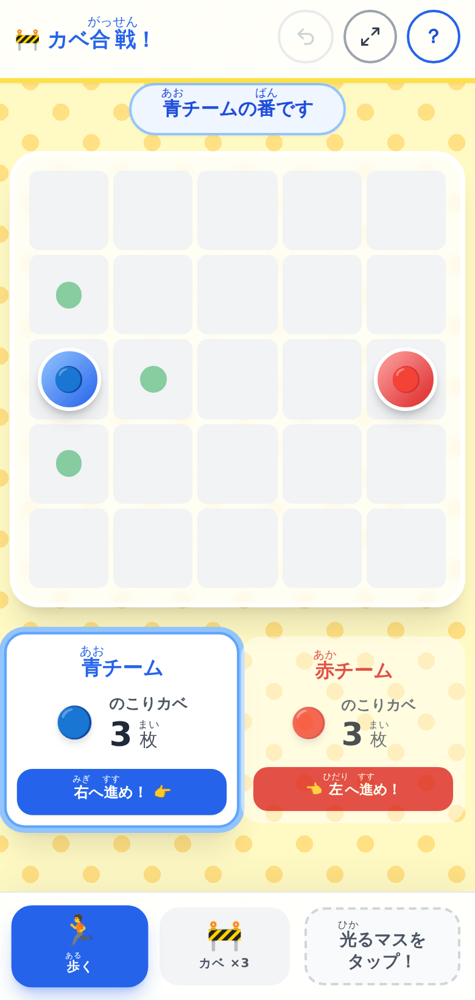

5x5で始めるとこうなります。マスが大きくて押しやすく、カベも3枚ずつしかないので、すぐ決着がつきます。1局の目安は3分から10分ほどで、盤が大きいほど長くなります。休み時間に出すなら5x5か7x7が向いていると思います。ルールは同じまま難しさだけ変えられるので、低学年は5x5、高学年は9x9、というふうに学年で使い分けることもできます。

そして、その下のハンデ設定。ここは青と赤で別々に増やしたり減らしたりできます。0枚から20枚までです。

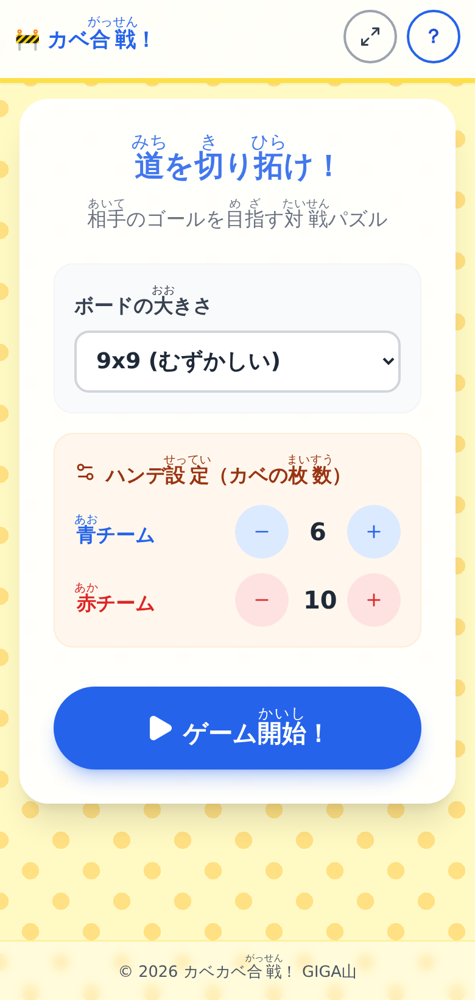

強い子のカベを減らして、はじめての子のカベは多いままにしておく。それだけで、力の差がある二人でも最後まで分からない勝負になります。0枚にすると、その子はカベを置けず、進むことしかできません。上級生が下級生に教えるときや、先生が相手をするときに使えると思って付けました。

「ゲーム開始！」を押すと、盤が出ます。

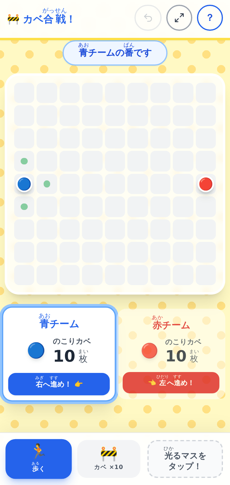

青は左のはしから出て右のはしへ、赤は右のはしから出て左のはしへ。先にたどり着いたほうの勝ちです。先手は青です。

いま動けるマスには、緑の丸が光ります。ここを押せばコマが動きます。押す場所が最初から見えているので、「どこを押せばいいの」と手が止まりません。

光っていないところを押したときは、音が鳴って、盤の上に短い案内が出ます。

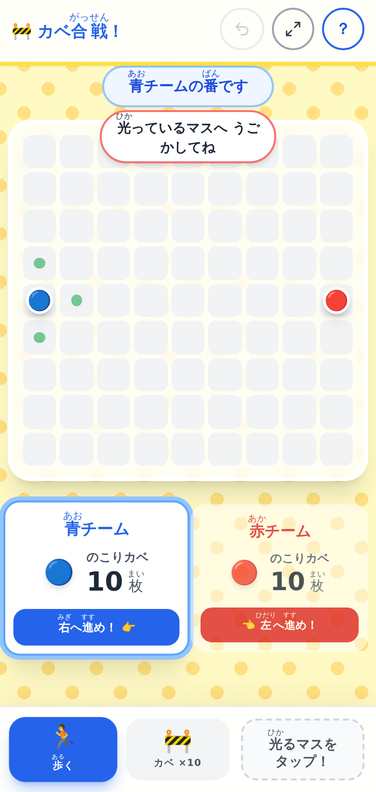

黙って何も起きないのが、いちばん分かりにくいと思ったのでこうしました。自分のコマを押したときも、同じ案内が出ます。このアプリには「コマを選んでから動かす」という手順がなく、行き先のマスを押すだけだからです。

コマは上下左右に1マスずつ。ただし、相手のコマととなり合ったときだけ、まっすぐ飛びこえて2マス進めます。

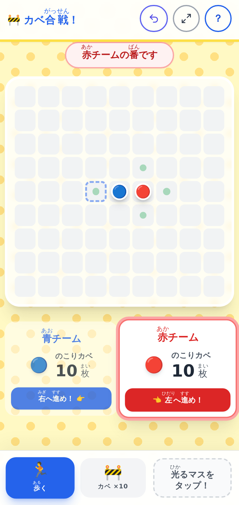

青と赤がとなり合っていて、赤の番です。青の向こう側のマスが光っているのが分かるでしょうか。ここを押すと、青を飛びこえて2マス進みます。

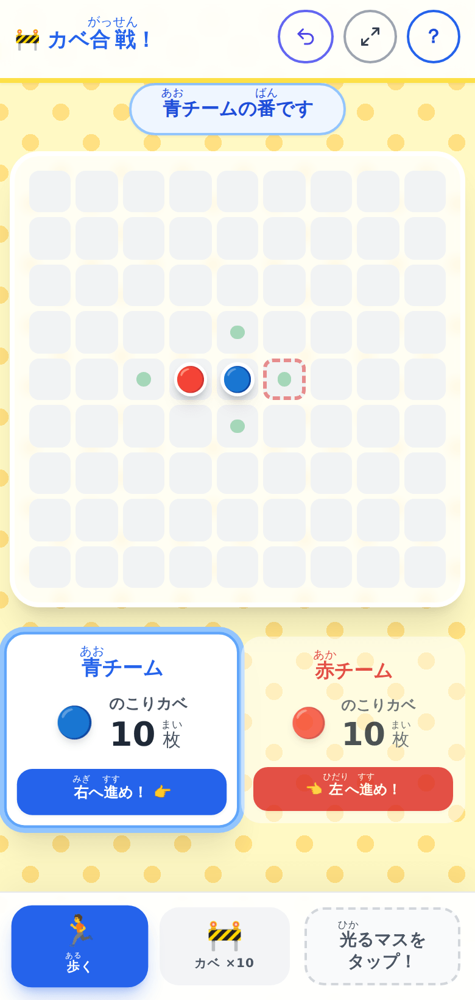

飛びこえたあとの画面です。点線の四角は、赤がさっきまでいた場所です。相手が何をしたのかが、次の1手まで盤の上に残ります。よそ見をしていた子も、これで追いつけます。

本式のコリドールには、飛びこえられないときにななめへ動けるルールがあります。このアプリでは、それを省きました。ルールが一つ増えるたびに、置いていかれる子が出ます。低学年でも最後まで自分で指せることのほうを取りました。飛びこえられないときは、回り込んでください。

あそびかたは、画面の右上にある「？」からいつでも読めます。

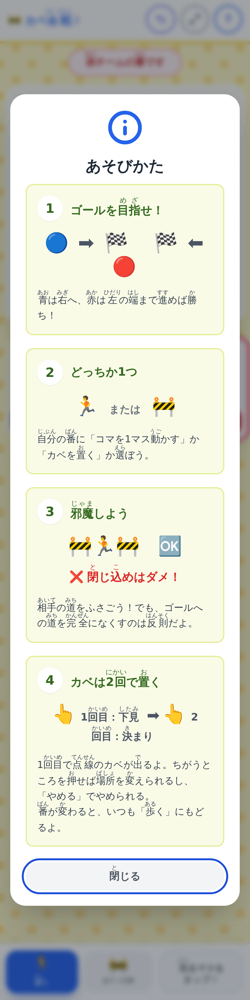

絵で分かる4枚です。「ゴールを目指せ」「どっちか1つ」「邪魔しよう」「カベは2回で置く」。文字を読むのがしんどい子でも、絵だけ見れば何をするゲームか分かるようにしてあります。子どもに聞かれるたびに説明しなくてよくなるので、はじめの1回だけ「困ったらこのマークを押してね」と伝えておけば済みます。

画面に出る漢字には、ぜんぶふりがなが付いています。付いていないのは、いちばん下に小さく出る作者名だけです。

## 🚧 押しまちがえが起きない「2回で置く」カベ

このアプリでいちばん気を使ったのが、カベの置きかたです。

自分の番には、コマを動かすか、カベを1枚置くか、どちらか一つを選びます。カベは2マスぶんの長さがあって、タテとヨコの向きを選んで置きます。

下のバーの「カベ」を押すと、こうなります。

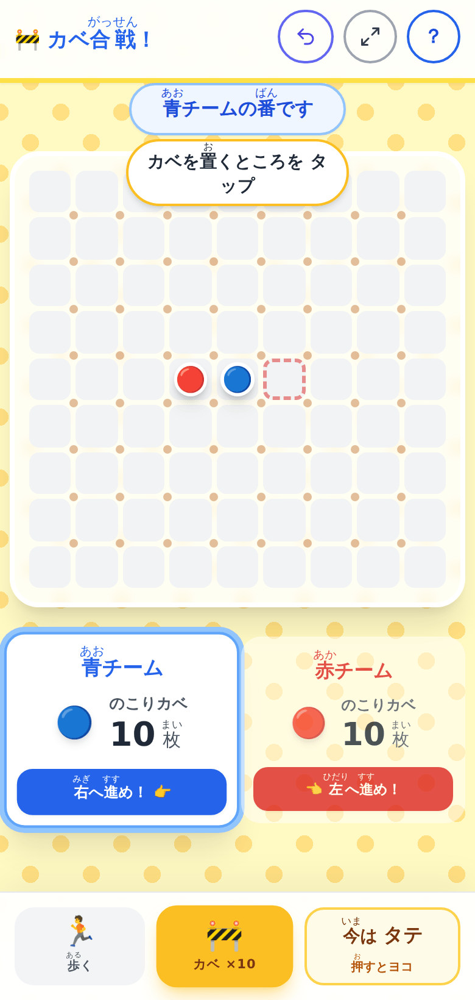

マスとマスの継ぎ目に、小さな点がたくさん出ました。これが「いまの向きで置けるところ」です。指で押す前に、置ける場所が全部見えています。

ここで、置きたいところを1回押します。

点線のカベが出ました。まだ置かれていません。下見です。下のバーも「やめる」「ここに置く！」「むきは タテ」の三つに変わります。

向きを変えたいときは、右のボタンを押します。

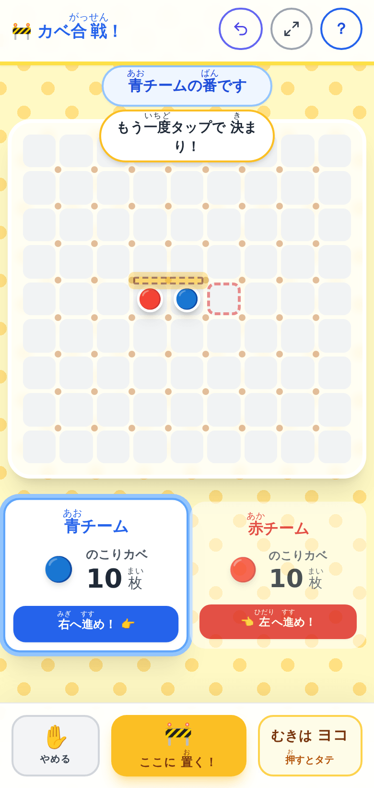

場所はそのままで、タテとヨコが入れかわりました。場所を変えたいときは、盤の別のところを押すだけです。やめるボタンを押しに戻る必要はありません。

決まったら、もう一度同じところを押すか、「ここに置く！」を押します。

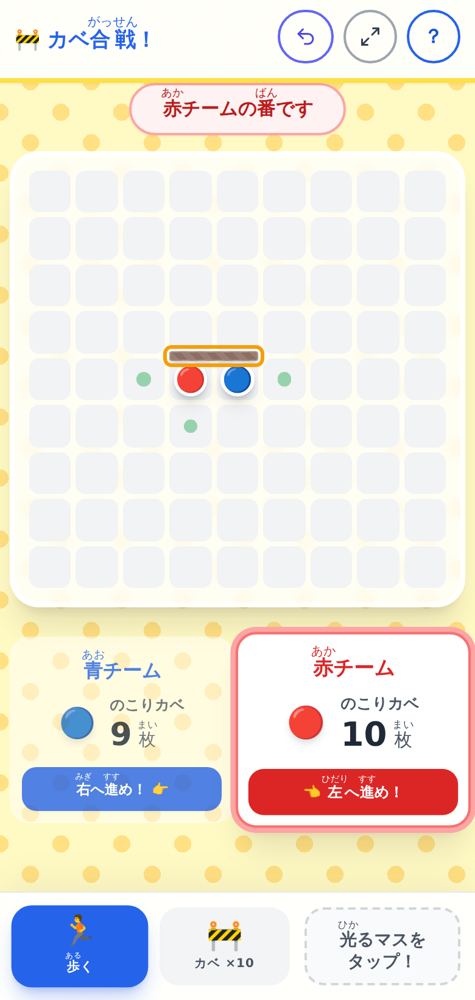

置かれたカベは、オレンジ色のわくで囲まれます。これも次の1手まで残るので、相手が何を置いたのかが一目で分かります。

なぜ2回に分けたのか。1回で置ける作りにしていたころ、いちばん多かったのが「動かしたかったのにカベが出た」でした。押しまちがえたことに気づいたときには、もう盤面が変わっています。低学年の子ほど、押してから考えます。だから、指が触れただけでは何も確定しないようにしました。

同じ理由で、番が変わるときは操作がかならず「歩く」に戻ります。前の人がカベモードのまま渡しても、次の人が知らずにカベを置いてしまうことはありません。入口はいつも同じ、を守っています。

それでも押しまちがえることはあります。そのために「待った！」があります。

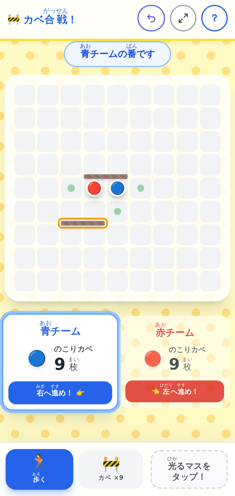

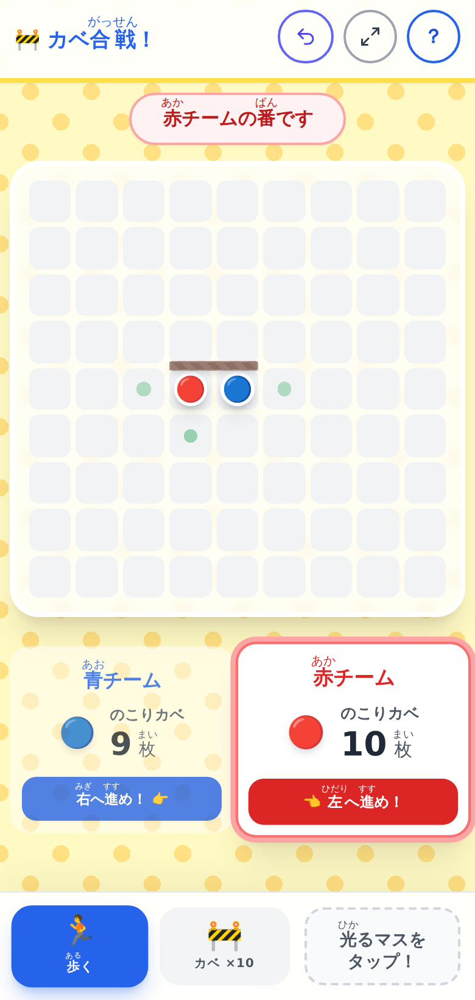

上が、青と赤が1枚ずつカベを置いたところ。下が「待った！」を押したあとです。赤の置いたカベが消えて、のこりカベの枚数も戻り、番も赤に戻っています。勝負がつくまで、何手でも戻せます。

「1回だけ」にしなかったのは、けんかの種を残したくなかったからです。回数に上限があると、「さっき使ったからだめ」という言い合いが必ず起きます。何回でも戻せるなら、そこで争う理由がなくなります。

## 🧠 反則になる置きかたは、アプリが止めます

カベのルールで一つだけ、絶対に守らないといけないものがあります。相手がゴールにたどり着けなくなる置きかたはできない、というものです。閉じこめてしまうと、そこでゲームが終わってしまうからです。

これは大人でも見落とします。子どもどうしなら、なおさらです。だからアプリのほうで判定して、置けないようにしました。

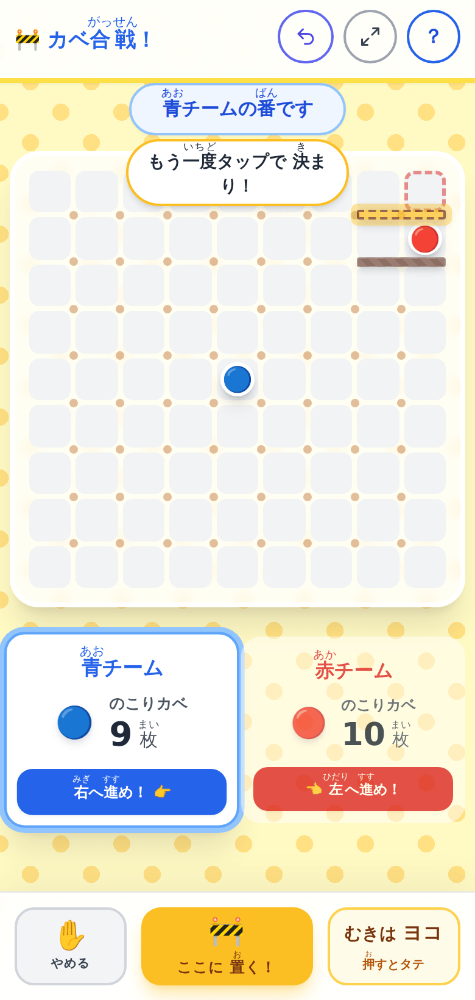

下見の色が黄色なら、そこには置けます。「ここに置く！」も押せる状態です。

同じ場所で、向きだけタテに変えてみます。

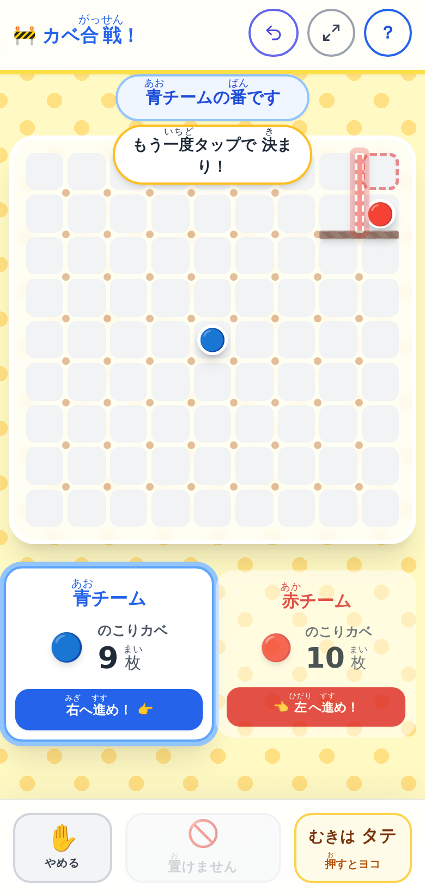

下見が赤くなって、まん中のボタンが「置けません」に変わりました。灰色になっていて、押せません。このとき盤の右上を見ると、赤のコマが、カベと盤のはしにはさまれて逃げ場をなくしているのが分かります。

そして、そうなった瞬間に理由も出ます。

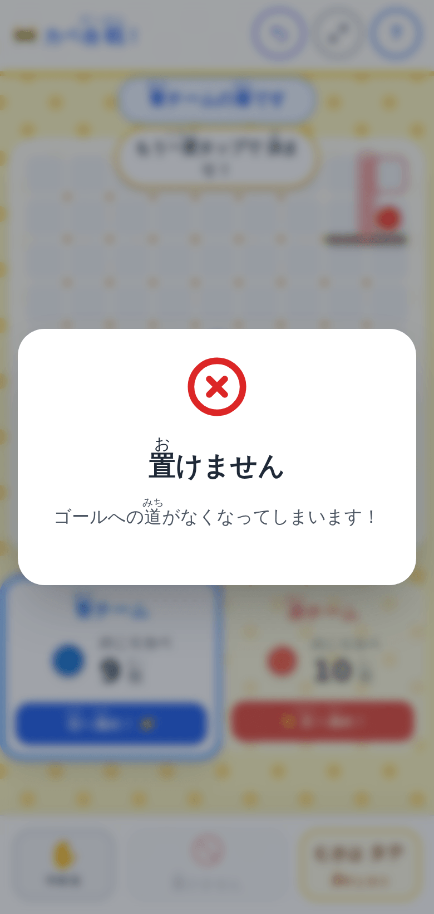

「ゴールへの道がなくなってしまいます！」。何がいけなかったのかが、その場で分かります。カベが重なるとき、十字に交差するとき、盤からはみ出すときも、それぞれちがう言葉で出ます。

盤の上に出ている小さな点は、この判定を通ったところにだけ出ています。つまり、点のところを押しているかぎり「置けません」は出ません。押す前に分かる、押したあとも理由が分かる。この二段構えにしたのは、審判を呼ばれないようにするためです。ルールを覚えていない子どうしでも、アプリが黙って線を引いてくれます。

## ✨ 導入のメリット

三つのいいことが期待できます。

一つ目は、準備がいらないことです。アドレスを開くだけで始まります。名前を入れる欄も、ログインもありません。班ごとに1台配って「はい、二人で」と言えば、それで成立します。片づけも要りません。駒をなくして探すことも、箱の中で盤が折れていることもありません。

二つ目は、けんかの仲裁から解放されることです。反則になる手はアプリが止めますし、押しまちがえは「待った！」で戻せます。先生が呼ばれる理由が、ほとんどなくなります。そのぶんの時間と気持ちを、うまく勝てなくて泣きそうになっている子のほうに向けられるのではないかと思っています。

三つ目は、先を読む練習になることです。カベを1枚置くということは、その番はコマを進めないということです。いま進むのか、じゃまをするのか。持ちカベは有限なので、使い切ったら進むしかありません。この選択がずっと続きます。教える側が何も言わなくても、二手先三手先を数える子が出てくるといいなと思って作りました。

## 🛠️ 【管理者向け】導入手順

情報担当の先生に聞かれそうなことを、先にまとめておきます。

まず、このアプリは外部のサービスを一つも使っていません。広告も、アクセス解析も、外から読みこむ文字の形も、何も入れていません。実際にアプリを開いて、コマを動かし、カベを置き、説明を開くところまでを試しながら、端末が取りに行った先を数えました。6件すべてがこのアプリ自身のアドレスで、外へ出ていく通信は0件でした。

そのため、校内のフィルタリングで許可していただくのは次の1か所だけです。

- quoridor.giga-school.com

ここが通れば動きます。ほかに開けていただく必要はありません。

次に、記録についてです。名前も、出席番号も、勝敗も、どこにも保存していません。入力する欄そのものがありません。端末の中にも残しませんし、外にも送りません。閉じると盤面は消えます。「待った！」の履歴も消えるので、局の途中で閉じてしまうと、そこから再開はできません。共用の端末で、前の子の記録が次の子に見えてしまうことはありません。

そのかわり、勝った回数を残したい場合は、紙に書くなど教室のやりかたでお願いします。ここは意図的に持たせていません。持たせると、名前を入れる欄が要ることになるからです。

端末に入れておくこともできます。入れておくとインターネットにつながっていなくても開けるので、校内の回線が混む時間帯でも待たされません。

- Chromebookやパソコンの Chrome では、画面の上に出る「アプリにする」を押します。出ていないときは、アドレスバーの右はしにある小さなアイコンか、右上のメニューから「アプリをインストール」を選びます
- iPadやiPhoneの Safari には「アプリにする」が出ません。共有ボタンを押して、メニューを下にスクロールし、「ホーム画面に追加」を選びます

新しい版が届いたときは、画面の下にお知らせが出ます。押すまで切りかわりません。対戦の途中で盤面が消えてしまうと悲しいので、そういう作りにしてあります。局が終わってから押してください。

電子黒板に映して一斉に説明するときは、上のバーにある四すみに矢印が向いたアイコンを押します。

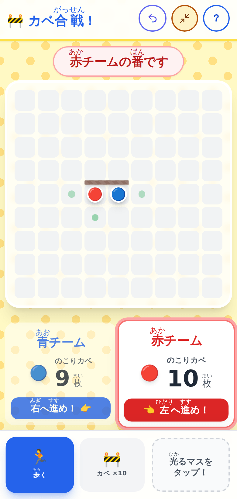

文字と操作が一回り大きくなり、あわせて全画面にもなります。端末によっては全画面にならないことがありますが、文字が大きくなるほうは必ず効きます。子どもの名前は一切入力しないので、そのまま映しても個人情報は出ません。

端末の向きについても書いておきます。横向きで画面の高さが低いときは、下のバーが画面の右がわの縦バーに移ります。

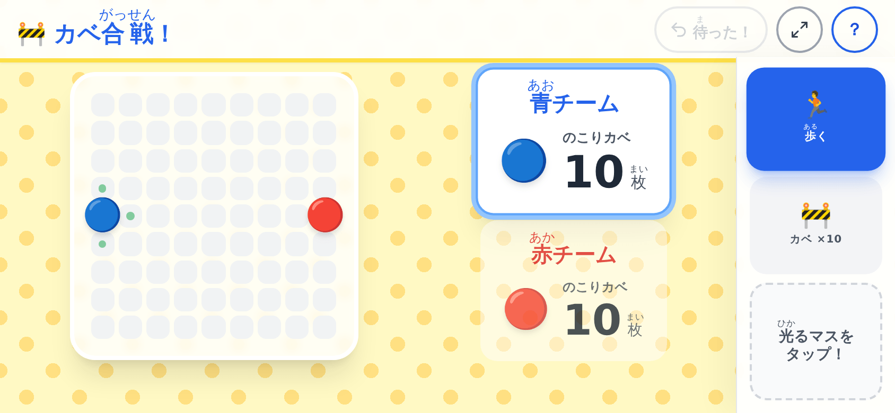

盤をできるだけ大きく見せるためです。上下のバーが隠れるので、そのぶん盤に使えます。

いくつか、先に知っておいていただきたいこともあります。

小さい画面で9x9を選ぶと、1マスが25ピクセルほどになります。指で押しやすい大きさの目安が44ピクセルなので、その半分ほどです。盤の高さは画面の高さで決まってしまうので、どう組んでもこれ以上大きくできませんでした。320ピクセル幅の端末をお使いの場合は、5x5か7x7を選んでください。押しまちがえても「待った！」で戻せますし、キーボードの矢印キーとEnterでも指せます。

音を消すスイッチはありません。端末の音量つまみで調節してください。ブラウザの決まりで、「ゲーム開始！」を押すまでは音が鳴らないようになっています。

配慮の要る子がいる学級のために、いくつか対応してあります。画面の漢字にはふりがなが付いています。読み上げを使っている子には、いま誰の番か、のこりカベは何枚か、そのマスに何があるかが読み上げられるようにしてあります。端末の設定で「動きを減らす」を有効にしている子には、光ったり点滅したりする表現が止まります。ただし止まっても分からなくならないように、カベの下見も直前の1手も、色と枠と影で見分けられるようにしてあります。文字と背景の濃さを強くする設定にも合わせて変わります。マウスやタッチが使いにくい子は、キーボードだけで最後まで指せます。

もし画面が真っ白のまま出ないときは、10秒ほど待つと直しかたの画面が自動で出ます。出てきたボタンを上から順に押してください。それも出ないときは、アドレスのうしろに ?fix=1 を付けて開くと、端末に残った古いデータを消して開き直します。何台もまとめて直したいときは、このアドレスを配るのがいちばん早いです。同じ端末に入っているほかの学習アプリのデータは消しませんので、そこはご安心ください。

## 📖 【利用者向け】使い方のガイド

子どもたちに配るときの手順です。

1. 二人ペアになって、1台の端末を机のまん中に置きます
2. ブラウザでアドレスを開きます
3. 盤の大きさを選びます。はじめての子は5x5が遊びやすいです
4. カベの枚数を決めます。そのままでもかまいません
5. 「ゲーム開始！」を押します
6. 左が青、右が赤です。どちらの色をやるか決めます。先手は青です
7. 自分の番が来たら、コマを動かすか、カベを置くかを選びます
8. コマを動かすときは、光っている緑の丸のマスを押します
9. カベを置くときは、下の「カベ」を押してから、置きたい継ぎ目を1回押します。点線が出たら、もう一度同じところを押すか「ここに置く！」を押します
10. 向きを変えたいときは、右の「むきは」のボタンを押します。やめたいときは「やめる」を押します
11. まちがえたら「待った！」を押します。何回でも戻せます
12. 先に反対がわのはしにたどり着いたほうの勝ちです

キーボードだけでも遊べます。Tabキーで盤に入り、矢印キーで選ぶマスを動かし、EnterかSpaceで決めます。カベはEnterを2回で置きます。下見の途中は矢印キーで下見そのものが動き、Escでやめられます。マウスやタッチが使いにくい子は、こちらでどうぞ。

## 📝 まとめ

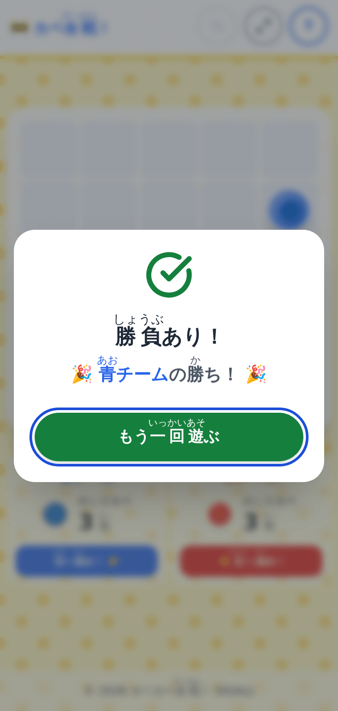

勝負がつくと、こう出ます。「もう一回遊ぶ」を押せば、すぐ次の一局です。

このアプリでやりたかったのは、時間を短くすることではありません。むしろ、二人で盤をのぞきこんで黙りこむ時間を、教室の中に作りたかったのです。ルールの説明も、反則の判定も、押しまちがえの後始末も、機械にやらせられるものは全部やらせる。そうやって空いたところに、子どもと向き合う時間が入ってくるといいなと思っています。

先生が審判をしなくてよくなったぶん、負けて悔しがっている子の横に座れます。「どうしてそこにカベを置いたの」と聞けます。効率化そのものが目的ではなくて、目的はそこにあります。

ルールは覚えることが少なく、盤の大きさで難しさを変えられます。準備は、アドレスを開くだけです。雨の日の休み時間に、あるいはすきま時間に、一度出してみていただけたらうれしいです。

一歩踏み出そうとする先生を、私はいつでも全力で応援しています。
